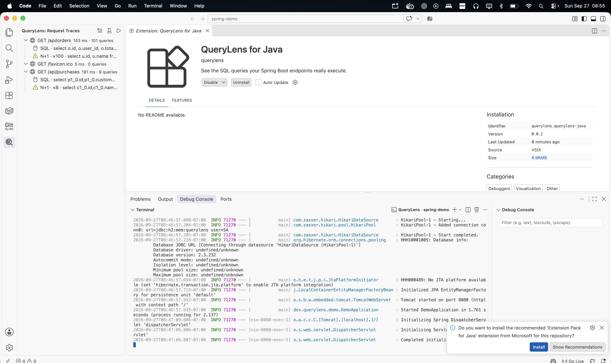

# QueryLens for Java

QueryLens makes the SQL generated by Spring Boot applications visible inside
VS Code. The first milestone focuses on request-level query traces and N+1
detection without sending application data to an external service.



## Features

- Groups SQL queries by HTTP request
- Detects repeated queries and possible N+1 problems
- Shows request duration and total query count
- Opens the Java source location that triggered a query
- Starts Maven and Gradle Spring Boot projects with one command
- Runs locally without uploading source code or SQL traces

## Repository layout

- `extension/` — VS Code extension and trace explorer
- `agent/` — local Java agent and trace event model
- `examples/spring-demo/` — reproducible Spring Boot sample with an intentional N+1 query

## Run the extension

```bash
cd extension
npm install
npm run compile
```

Open the repository in VS Code and press `F5`. In the Extension Development
Host, open **QueryLens** from the activity bar. Use **Load Demo Trace** to see
the initial request-to-SQL experience.

For an opened Maven or Gradle Spring Boot project, click the play button in the
QueryLens view or run **QueryLens: Run Spring Boot with Agent**. The extension
starts the project with its bundled Java agent. Click a captured SQL row to
jump to the Java source location that triggered it.

## Quick tutorial

1. Open a Spring Boot 3 project.
2. Open QueryLens from the VS Code activity bar.
3. Select **Run Spring Boot with Agent**.
4. Send a request to a Spring MVC endpoint.
5. Select the captured request to open its visual dashboard.
6. Expand the request to inspect SQL and select a query to jump to Java source.

The status bar shows when the local collector is ready. The built-in
**QueryLens: Open Getting Started** walkthrough explains the same workflow
inside VS Code.

## Build the Java agent

```bash
cd agent
mvn test
mvn package
```

Run the example application with the shaded agent:

```bash
cd examples/spring-demo
mvn spring-boot:run \
  -Dspring-boot.run.jvmArguments="-javaagent:../../agent/target/querylens-agent-0.0.1-SNAPSHOT-all.jar"
```

Then request `http://localhost:8080/api/purchases`. The trace is sent only to
the local QueryLens collector at `127.0.0.1:4318`. The collector port and N+1
repetition threshold are configurable in VS Code settings.

## Privacy

QueryLens is local-first. Trace data stays on the developer's machine.

## Status

Early development preview. APIs and trace formats may change.

## License

Apache License 2.0.
